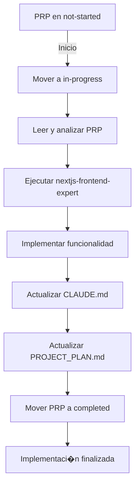

# execute-prp

## Descripci�n
Ejecuta un Product Requirements Prompt (PRP) para implementar una funcionalidad en Fantasync PWA. Este comando utiliza el agente nextjs-frontend-expert para realizar la implementaci�n completa, gestiona el flujo de trabajo del PRP y actualiza la documentaci�n del proyecto.

## Uso
```
/execute-prp <nombre-del-archivo-prp>
```

## Argumentos
- `nombre-del-archivo-prp`: Nombre del archivo PRP a ejecutar (requerido)
- Argumento a utilizar: $ARGUMENTS

## Comportamiento

Este comando ejecutar� los siguientes pasos en orden:

### 1. **Preparaci�n del Flujo de Trabajo**
- Busca el archivo PRP en `/Users/pablonunezruiz/repos/proyectos-propios/fantasync-pwa/.claude/PRPs/not-started/`
- Mueve el archivo PRP a `/Users/pablonunezruiz/repos/proyectos-propios/fantasync-pwa/.claude/PRPs/in-progress/`
- Marca el inicio de la implementaci�n con timestamp

### 2. **An�lisis del PRP**
- Lee el contenido completo del PRP especificado
- Extrae los requisitos funcionales y t�cnicos
- Identifica las tareas de implementaci�n
- Analiza las dependencias y componentes afectados

### 3. **Invocaci�n del Agente Frontend Expert**
Utiliza el agente `nextjs-frontend-expert` definido en `/Users/pablonunezruiz/repos/proyectos-propios/fantasync-pwa/.claude/agents/nextjs-frontend-expert.md` para:

#### Tareas de Implementaci�n:
- **Setup Inicial**
  - Instalar dependencias necesarias
  - Configurar servicios de Supabase requeridos
  - Crear estructura de carpetas necesaria

- **Desarrollo Backend**
  - Crear/actualizar esquemas Prisma
  - Implementar pol�ticas RLS en Supabase
  - Configurar Edge Functions si son necesarias
  - Setup de Realtime channels y Storage buckets

- **Desarrollo Frontend**
  - Crear componentes React con TypeScript
  - Implementar l�gica de estado con Zustand
  - Configurar React Query para fetching
  - Aplicar estilos con Tailwind CSS y shadcn/ui
  - Implementar hooks personalizados

- **Integraci�n y Testing**
  - Conectar frontend con Supabase
  - Implementar manejo de errores
  - Crear tests unitarios b�sicos
  - Validar criterios de aceptaci�n

### 4. **Actualizaci�n de Documentaci�n**

#### Actualizar CLAUDE.md
El agente debe actualizar `/Users/pablonunezruiz/repos/proyectos-propios/fantasync-pwa/.claude/CLAUDE.md` con:
- Nuevos comandos espec�ficos de la funcionalidad
- Actualizaci�n del estado del proyecto
- Nuevos flujos de datos implementados
- Componentes y servicios a�adidos
- Consideraciones de performance espec�ficas

#### Actualizar PROJECT_PLAN.md
El agente debe actualizar `/Users/pablonunezruiz/repos/proyectos-propios/fantasync-pwa/.claude/PROJECT_PLAN.md` y `/Users/pablonunezruiz/repos/proyectos-propios/fantasync-pwa/.claude/ARCHITECTURE.md` con:
- Marcar tareas completadas en el roadmap
- Actualizar m�tricas de progreso
- Documentar decisiones t�cnicas tomadas
- A�adir nuevas dependencias al stack
- Actualizar estimaciones si es necesario

### 5. **Finalizaci�n del Flujo**
- Mueve el archivo PRP desde `/Users/pablonunezruiz/repos/proyectos-propios/fantasync-pwa/.claude/PRPs/in-progress/`
- Lo coloca en `/Users/pablonunezruiz/repos/proyectos-propios/fantasync-pwa/.claude/PRPs/completed/`
- A�ade metadata de finalizaci�n (fecha, duraci�n, notas)

## Estructura del Flujo de Trabajo



## Validaciones del Comando

### Pre-condiciones:
- El archivo PRP debe existir en la carpeta `not-started`
- El proyecto debe tener las dependencias base instaladas
- La estructura de carpetas del proyecto debe estar creada

### Post-condiciones:
- La funcionalidad debe estar completamente implementada
- Todos los tests deben pasar
- La documentaci�n debe estar actualizada
- El PRP debe estar en la carpeta `completed`

## Ejemplos de Uso

### Ejemplo 1: Implementar Sistema de Autenticaci�n
```
/execute-prp PRP-20250830-auth-system.md
```

El comando:
1. Mueve `PRP-20250830-auth-system.md` a `in-progress`
2. Implementa autenticaci�n con Supabase Auth
3. Actualiza CLAUDE.md con nuevos comandos de auth
4. Actualiza PROJECT_PLAN.md marcando auth como completado
5. Mueve el PRP a `completed`

### Ejemplo 2: Implementar Chat en Tiempo Real
```
/execute-prp PRP-20250830-realtime-chat.md
```

El comando:
1. Mueve `PRP-20250830-realtime-chat.md` a `in-progress`
2. Implementa chat con Supabase Realtime
3. Actualiza documentaci�n con flujos de mensajer�a
4. Mueve el PRP a `completed`

### Ejemplo 3: Sistema de Dados
```
/execute-prp PRP-20250830-dice-system.md
```

## Manejo de Errores

Si ocurre un error durante la implementaci�n:
1. El PRP permanece en `in-progress`
2. Se crea un log de error en el PRP
3. Se notifica el estado del error
4. La documentaci�n no se actualiza hasta resolver el error

## Checklist de Implementaci�n

El agente nextjs-frontend-expert debe verificar:

- [ ] **C�digo**
  - [ ] TypeScript sin errores
  - [ ] ESLint sin warnings cr�ticos
  - [ ] Componentes documentados con JSDoc
  - [ ] Props tipadas correctamente

- [ ] **Funcionalidad**
  - [ ] Todos los requisitos funcionales implementados
  - [ ] Criterios de aceptaci�n cumplidos
  - [ ] Manejo de errores implementado
  - [ ] Estados de carga considerados

- [ ] **Integraci�n**
  - [ ] Supabase correctamente configurado
  - [ ] RLS policies aplicadas y testeadas
  - [ ] Realtime funcionando si aplica
  - [ ] Storage configurado si aplica

- [ ] **Testing**
  - [ ] Tests unitarios creados
  - [ ] Tests de integraci�n b�sicos
  - [ ] Pruebas manuales realizadas

- [ ] **Documentaci�n**
  - [ ] CLAUDE.md actualizado
  - [ ] PROJECT_PLAN.md actualizado
  - [ ] Comentarios en c�digo complejo
  - [ ] README actualizado si es necesario

## Notas Importantes

- El agente debe seguir estrictamente las especificaciones del PRP
- Debe respetar la arquitectura establecida en ARCHITECTURE.md
- Usar las mejores pr�cticas de Next.js 15 y React 19
- Implementar con un enfoque mobile-first para PWA
- Considerar performance y accesibilidad
- Mantener consistencia con el c�digo existente
- No sobre-ingenierizar soluciones simples
- Priorizar la experiencia de usuario as�ncrona

## Comandos Relacionados

- `/create-prp` - Crear un nuevo PRP
- `/list-prps` - Listar PRPs por estado
- `/review-prp` - Revisar un PRP completado
- `/rollback-prp` - Revertir una implementaci�n

## Registro de Actividad

El comando mantiene un log de:
- Timestamp de inicio y fin
- Archivos creados/modificados
- Dependencias instaladas
- Tests ejecutados
- Errores encontrados
- Tiempo total de implementaci�n

Este registro se guarda en el mismo archivo PRP como metadata al final del documento.